# Florae Basket
Florae Basket was created by myself and two other peers. The project was part of a class that teaches development documentation. 
Our group decided we wanted to put in the extra work and finish the semester with a fully functional and polished piece of software, 
going beyond class expectations. Please forgive the lack of a commit history, as the project was developed on SIUE's Git server that 
GitHub does not support project migration from. Git structure was: master <- develop <- [use case branches].

### Description:
Florae Basket is a flower cataloging system designed for a biologist who is researching new species of flowers. The application has the 
ability to store data about flowers. This includes English name, Latin name, botanical family, notes about a flower, images, notes 
about an image, and time and date of entries. This data is searchable by three different methods: Text search, image search, and RGB 
search. After receiving the search results, the user has the option to save the results as a PDF or send the results to an attached 
printer. Florae Basket also has user accounts with different access levels. Admin accounts have full access to the application, 
researcher accounts have full access besides user creation, and standard user accounts have read only access. All user data is editable 
by admin accounts, and all flower data is editable by both admin and researcher accounts. All admin and researcher accounts also have 
the ability to view RGB frequency histograms associated with each image.

### Architecture and Design:
Florae Basket is built using n-tier architecture along with the controller and expert patterns. Beside images, all data is stored in an 
embedded relational database. Copies of all uploaded images are stored in an image folder in the application's startup directory. The 
database stores the file path to these images instead of the images themselves.

### My Role
Our group started with requirements elicitation, and developed use cases. Each use case was assigned to a group member, who created 
all documentation for that use case. We then worked our way up to building the project in a series of three sprints (unified-agile 
methodology.) I was in charge of initial project set up, this includes Git, the database, and the bases of the data object classes. 
Each person was responsible for their use cases from the front end GUI to the back end database. My uses cases were: search by text 
(including results display for all searches), search by histogram (image and RGB search), save search results as a PDF, login, and 
logout.

##### Files I created or worked on
- FloraeBasketGUI.cs (file is organized by use case with large headers above each section)
    *  "Search By Text" section
    *  "Image Search" section
    *  "Search By RGB" section
    *  "Login" section
    *  "Logout" section
- TextSearchController.cs
- SearchHistogramController.cs
- PdfController.cs
- LoginController.cs
- DBMgr.cs
    * IsMatch()
    * GetFlowers()
    * GetHistograms()
    * GetFlowerByHistogram()
    * GetImagesForFlower()
    * GetNotesForFlower()
- TESTS
    * TextSearchControllerTests.cs
    * SearchHistogramControllerTests.cs
    * LoginControllerTests.cs
    * PdfControllerTest.cs

### What's Next:
Right now there are no plans to use this in the future besides for practice. Throughout this school year, I will be taking an 
algorithms and data structures class and a databases class. As I learn more I would like to redo the search algorithms and a lot 
of the database manager SQL to make the search functionality more efficient.

### To Run:
To run the app, the solution may be ran in Visual Studio. Or, the executable found in FloraeBasket -> 
RELEASE may be downloaded and ran. For the executable to function properly, all files in RELEASE folder 
must be included in folder where FloraeBasket.exe is located. Also, see dependency #1 in the “Dependencies” 
section before attempting to run.
###### USERNAME: admin
###### PASSWORD: password

### Dependencies
1) SQL Server Express 2016 LocalDB. If Express LocalDB is not installed on the machine running the software, it will not get past login 
when Florae Basket tries to access the database. To run in Visual Studio, the "Data Storage and Processing" workload may be downloaded, 
or the individual LocalDB component may be downloaded. Modify -> Individual components -> Cloud, Database, and Server -> 
SQL Server Express 2016 LocalDB. This can be modified via the Visual Studio Installer. Express LocalDB may also be downloaded directly 
from Microsoft. After LocalDB is downloaded in either fashion, the executable may be ran.
2) IronPDF, a C# library that allows PDF creation with HTML. Currently, the application is using the free trial version that is free 
for personal use and development testing. This means Florae Basket may not under any circumstances be deployed to clients. Personal Git 
only. When ran as an .exe, it will leave a watermark on the PDF file, which is fine for this proof of concept application.
3) Adobe Acrobat must be set as the default PDF viewer on the computer that the software runs on for the print functionality to work.

### Example Images
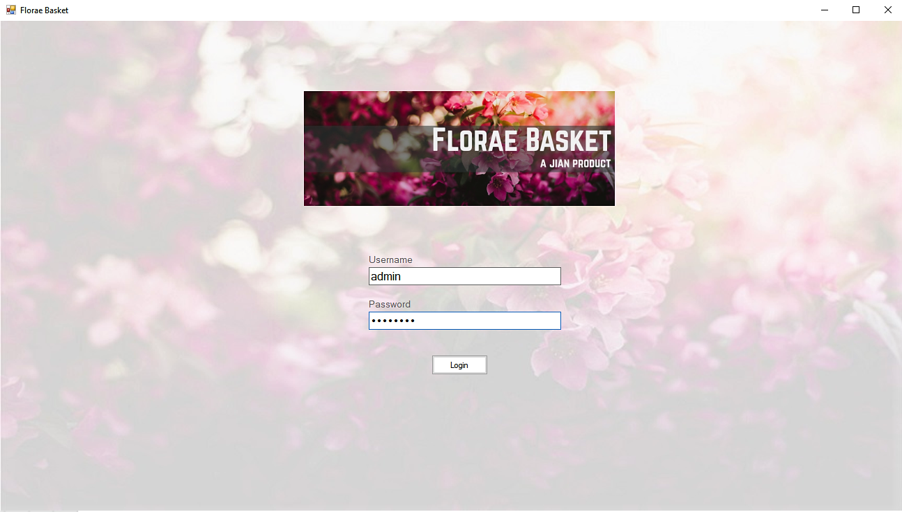 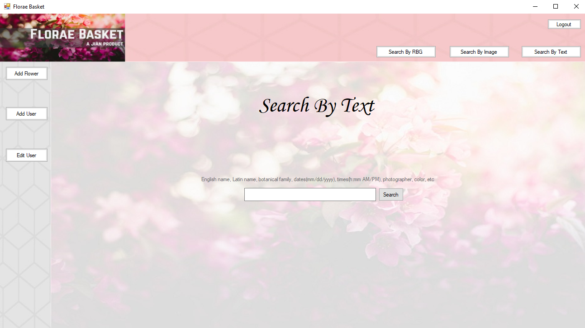 
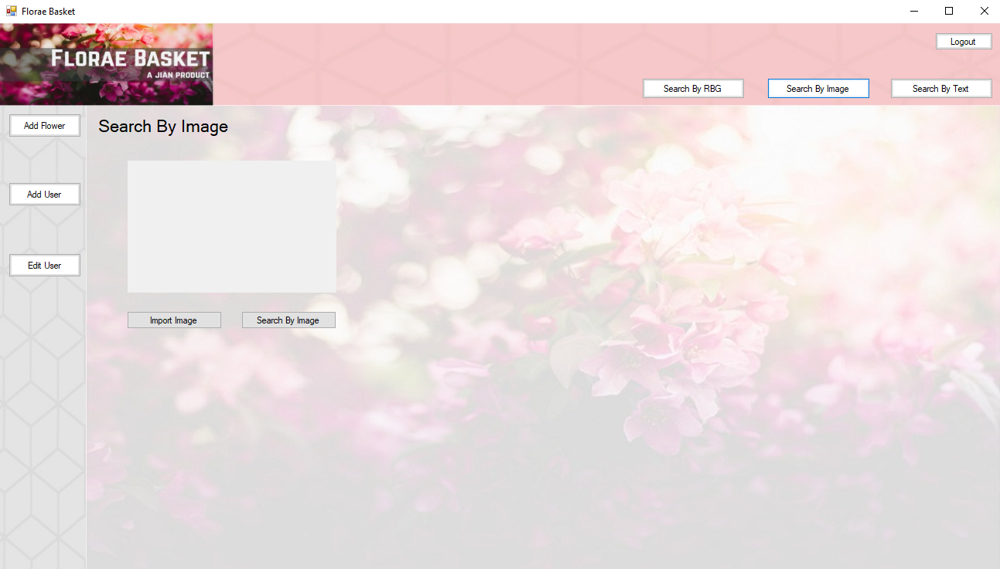 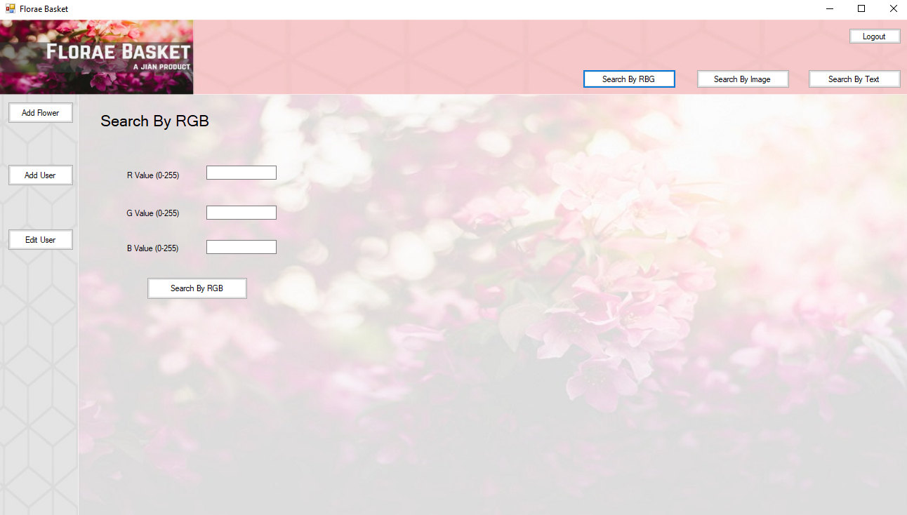 
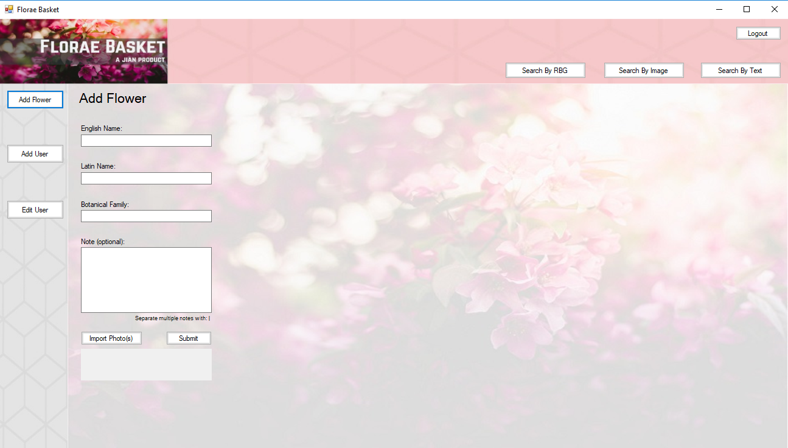  
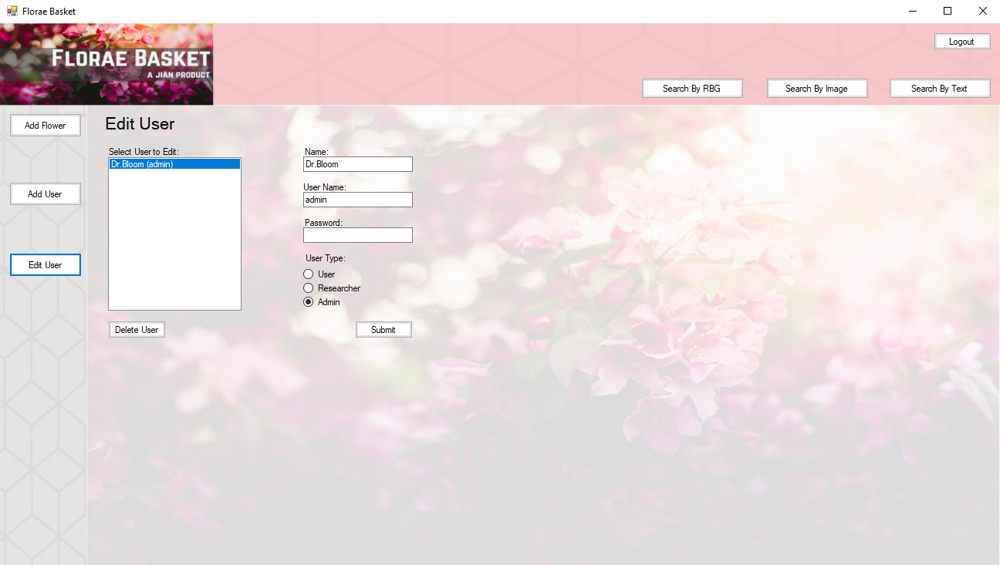 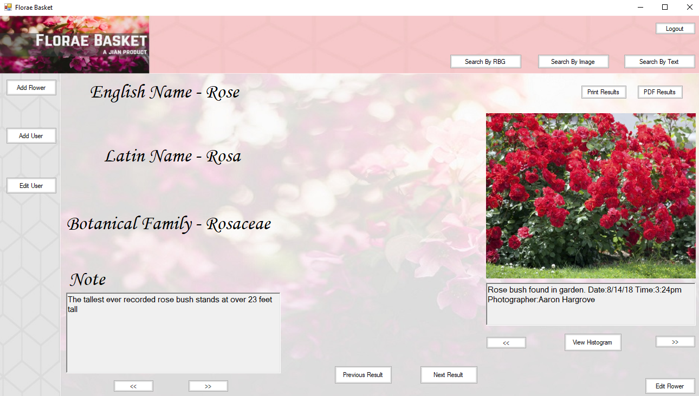 
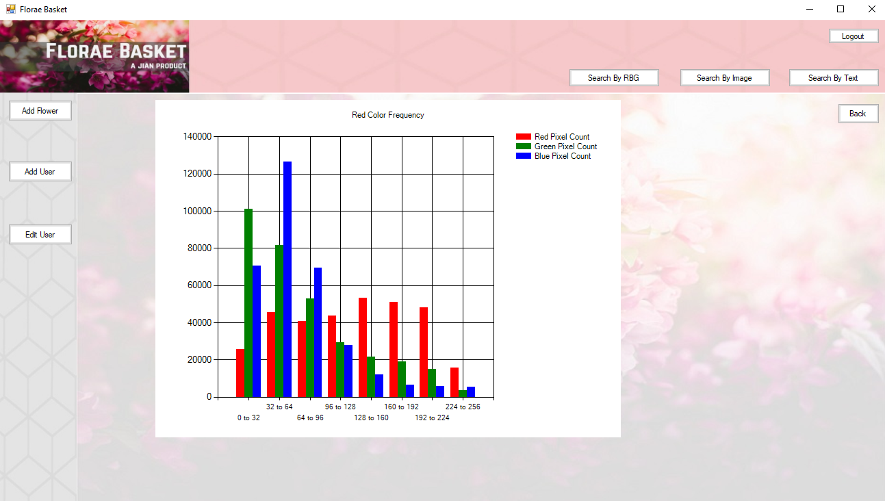 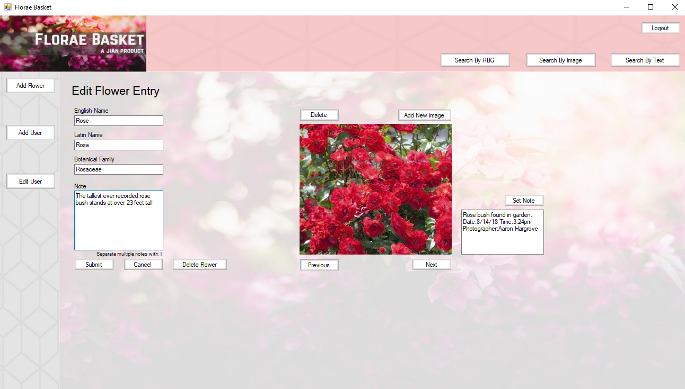

### Documentation Examples
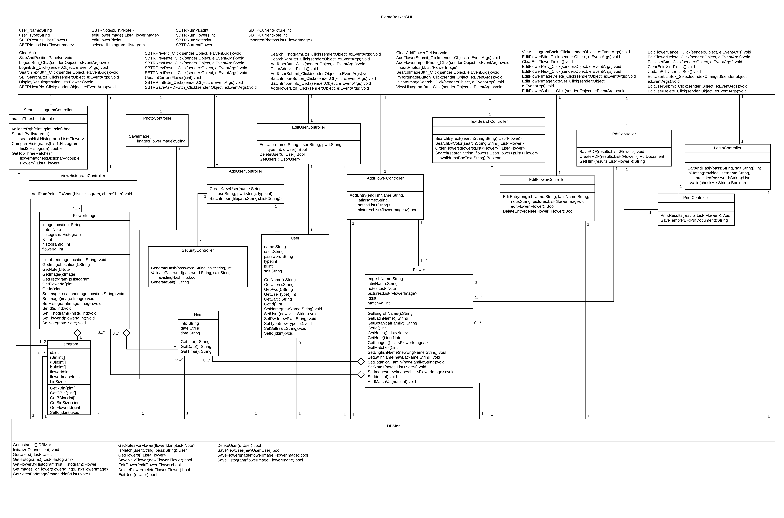
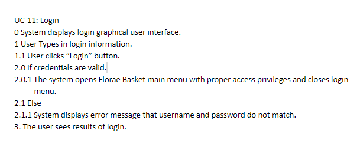  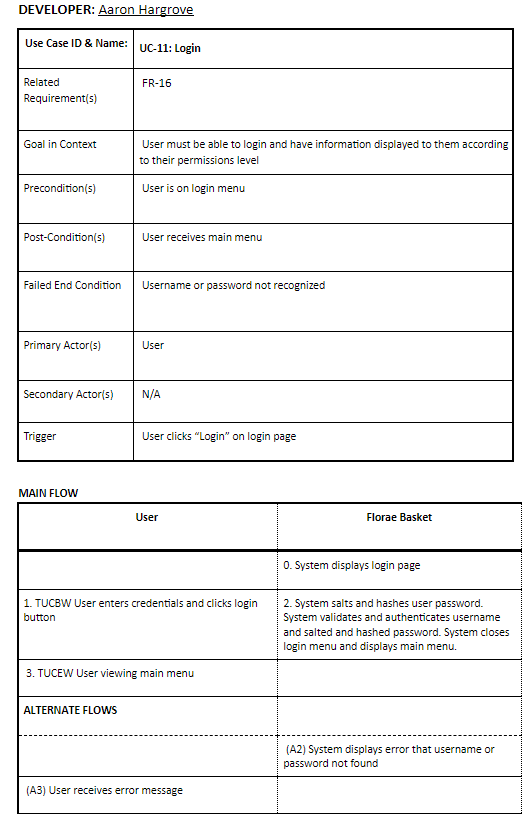 
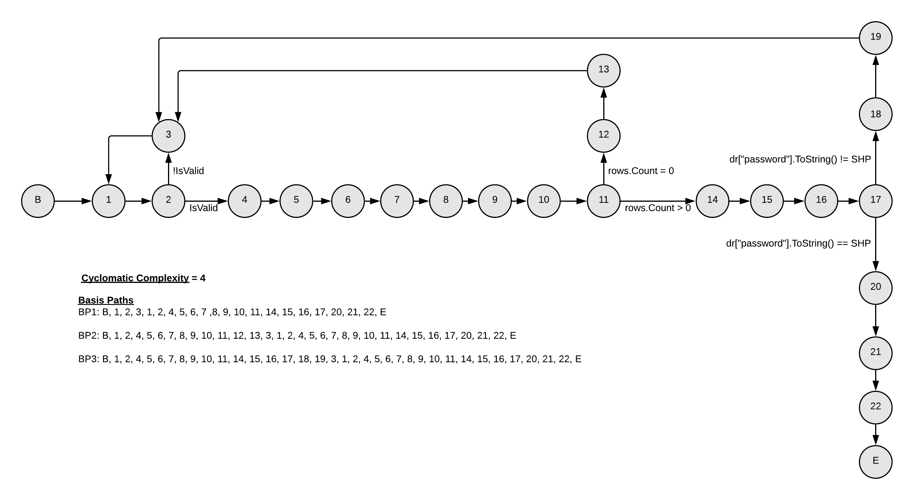 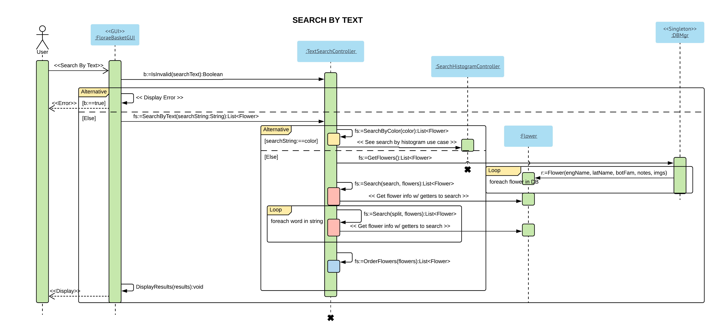 
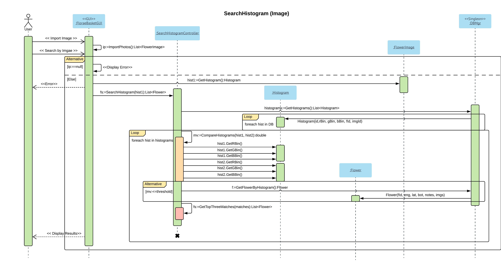 
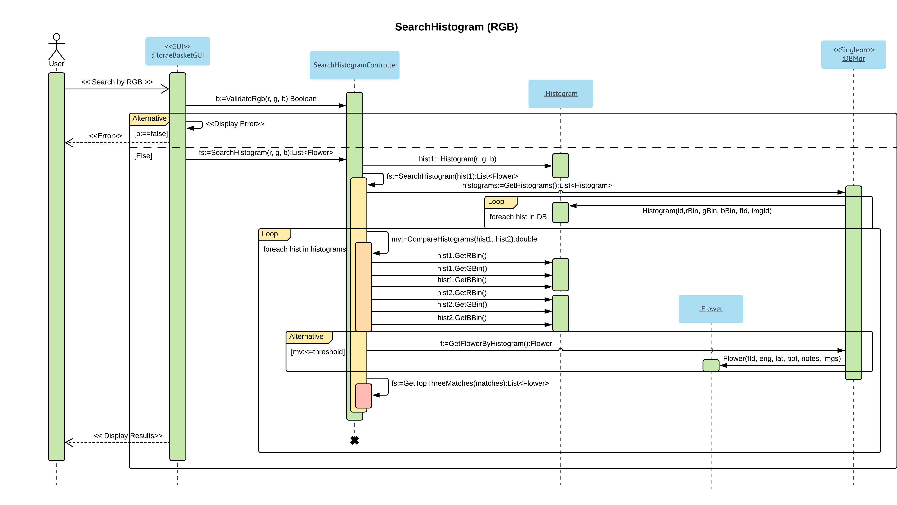 
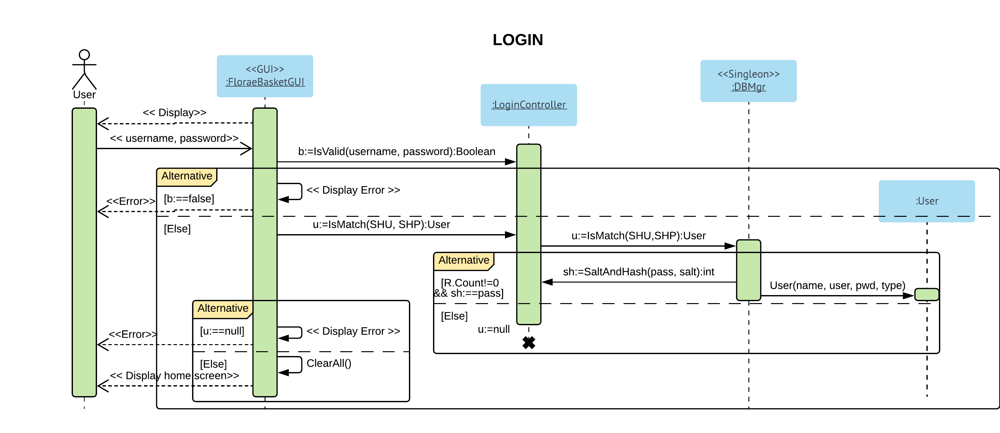 
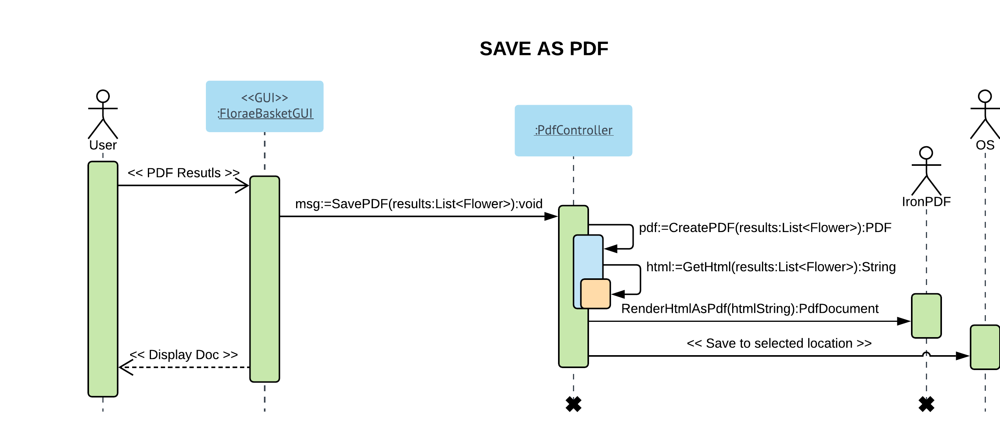

